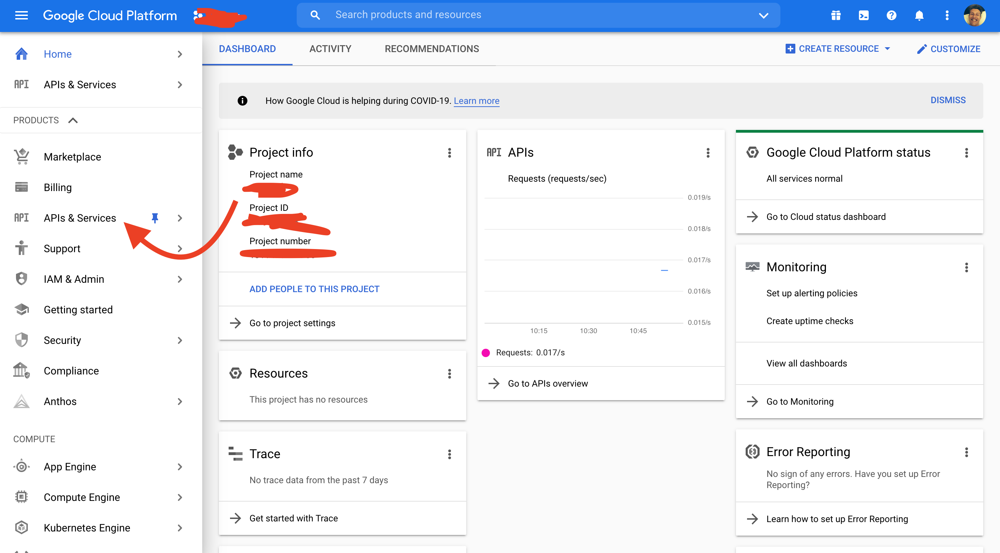
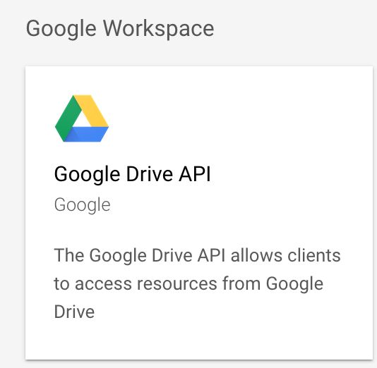
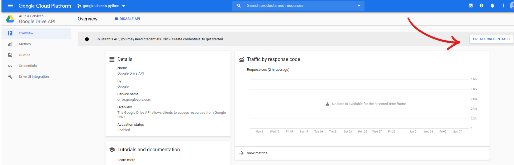
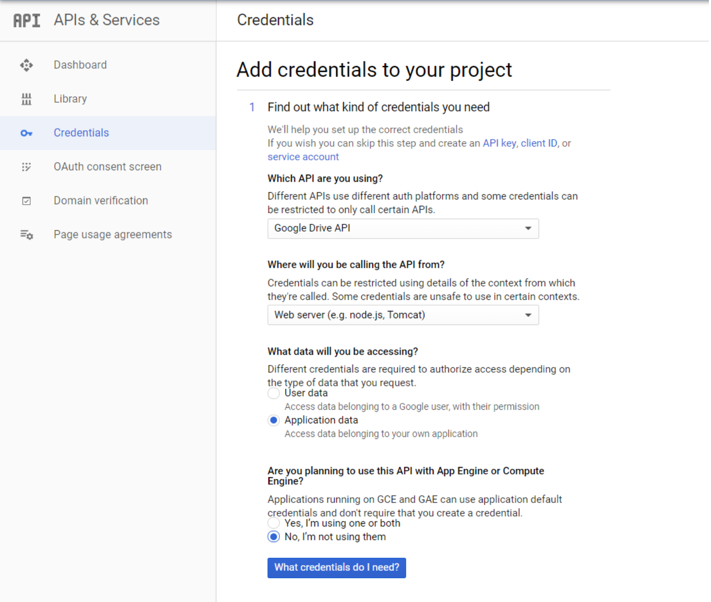
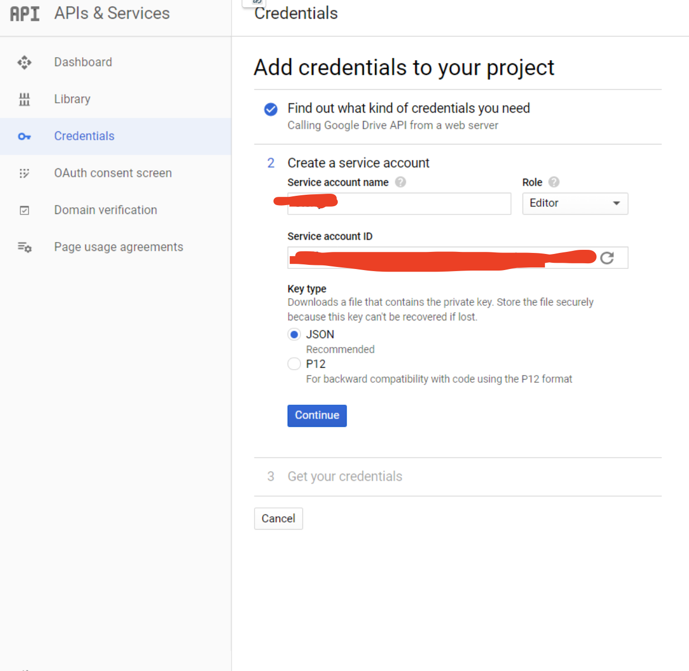

# Google Sheet Reader
### What does the application do?
This application accepts a link to a publicly available Google Sheet, defines type of data in each column, and returns the defined types in table on the next page.
### How does the application work?
Application sets the credentials for Google Sheets API and then with a help of **gspread** lib authorizes to client using those credentials.
After that **gspread** lib open and read data in the Google Sheet which was provided by user via a link (Google Sheet should be publicly available).
And finally using Python application defines data types and presenting all of that information in HTML table.
### Application
  https://google-mango.herokuapp.com

## Project Setup

```
git clone https://github.com/fastik17/google_mango 
```


Create a virtualenv using Python 3 and install dependencies.
```
python3 -m venv <name_of_virtualenv>
. <name_of_virtualenv>/bin/activate
pip install -r requirements.txt
```


##Set up Google Sheets API

1. Log into [google-console](console.cloud.google.com) and create a new project. You should be automatically redirected to the main dashboard of your new project.
Then, navigate to APIs & Services > Library:
   

   
   

2. Scroll down to the G Suite section and click on the Google Drive API, then enable it.
   

   
   

   You’ll be redirected to the following page, click on “create credentials” 
   

   

3. Fill in the form with the following details.
   

   


   Replace “service account name” with a name you like.


   
   

4. After clicking “continue” a JSON file containing your credentials should automatically be downloaded.
   Open it you will use the values to set the following variables into .env:
   ```
   GOOGLE_PRIVATE_KEY="<private_key_from_credentials_json>"
   GOOGLE_CLIENT_EMAIL="<client_email_from_credentials_json>"
   ```
   Use .env.example to create .env:
   ```
   $ cp .env.example .env
   ```
   Setup it with new creds from JSON file


5. Finally, do the same for the Google Sheets API by searching for it in the G Suite section and enabling it. However, unlike the Google Drive API, you don’t need to create any credentials.


## Run server
   
Run
   ```
   FLASK_APP=app.py flask run
   ```

   

 
